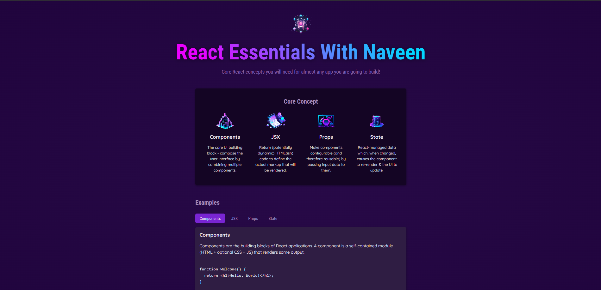

# React Essentials

A React learning application that demonstrates the core concepts of React development through an interactive interface.



## Features

- **Core Concepts Display**: Visual presentation of React fundamentals
- **Interactive Examples**: Tabbed interface showcasing different React concepts
- **Dynamic Content**: Real-time code examples and descriptions
- **Modern React**: Built with React 19 and modern hooks

## Core Concepts Covered

- **Components**: UI building blocks for composing user interfaces
- **JSX**: JavaScript syntax extension for defining markup
- **Props**: Component configuration through input data
- **State**: React-managed data for dynamic UI updates

## Getting Started

### Prerequisites

- Node.js (version 14 or higher)
- npm or yarn package manager

### Installation

1. Clone the repository:
```bash
git clone <repository-url>
cd React-Essentials
```

2. Install dependencies:
```bash
npm install
```

3. Start the development server:
```bash
npm run dev
```

4. Open your browser and navigate to `http://localhost:5173`

## Available Scripts

- `npm run dev` - Start development server
- `npm run build` - Build for production
- `npm run preview` - Preview production build

## Project Structure

```
src/
├── assets/          # Images and static assets
│   ├── components.png
│   ├── config.png
│   ├── jsx-ui.png
│   ├── react-core-concepts.png
│   └── state-mgmt.png
├── components/      # React components
│   ├── Header/      # Header component with styles
│   ├── CoreConcept.jsx
│   ├── CoreConcepts.jsx
│   ├── Examples.jsx
│   ├── Section.jsx
│   ├── TabButton.jsx
│   └── Tabs.jsx
├── App.jsx          # Main application component
├── data.js          # Application data and examples
├── index.css        # Global styles
└── index.jsx        # Application entry point
```

## Technologies Used

- React 19
- Vite (build tool)
- JavaScript/JSX
- CSS3

## Learning Objectives

This project helps you understand:
- Component composition and reusability
- State management with useState hook
- Event handling in React
- Conditional rendering
- Props passing and destructuring
- Component wrapper patterns
- Modern React development workflow
